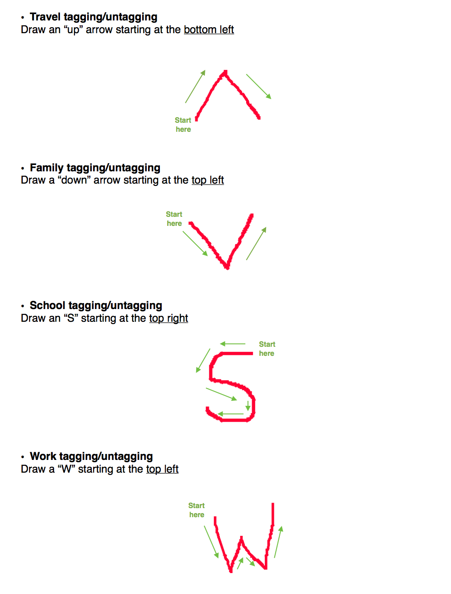
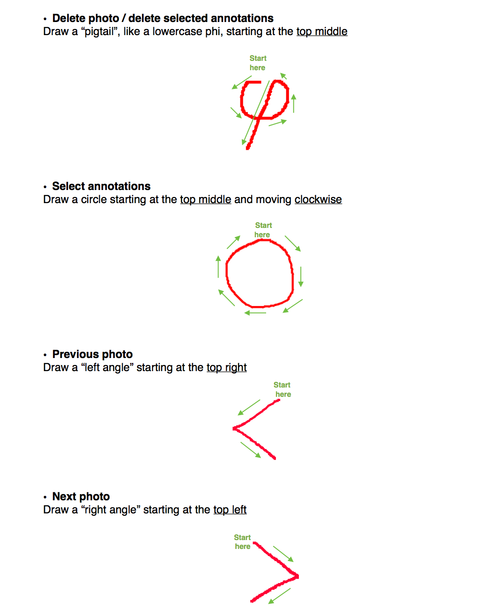
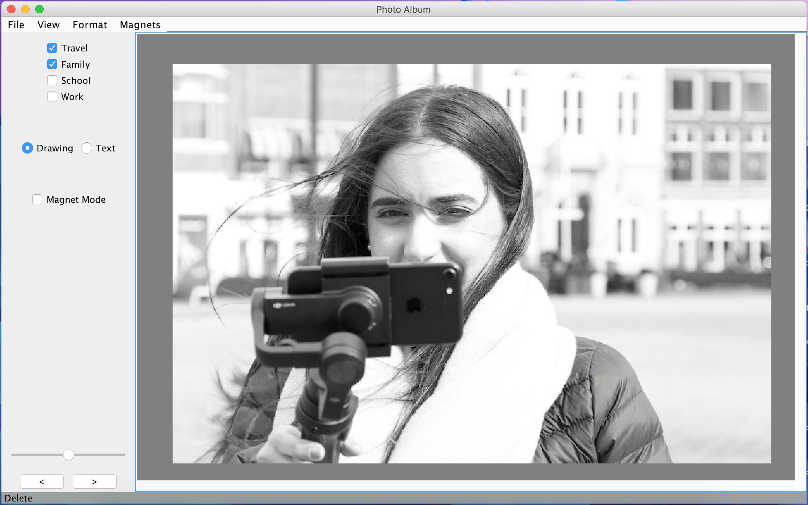

# PhotoAlbum
This is a project I built for the class CS 4470: User Interface Software at Georgia Tech.

Photo Album is an application built with Java, which allows you to view photos, annotate them, and organize them in a variety of ways.

# Features
- Gestures
<p align="center">
    
    
</p>

- Tagging
Photos can be "tagged" by selecting one or more of Travel, Family, School, or Work on the top left corner of the application.
<p align="center">
    
</p>


- Annotations

# How to Run
Once you have downloaded the album.jar file, run the following command:

```sh
java -jar album.jar
```
