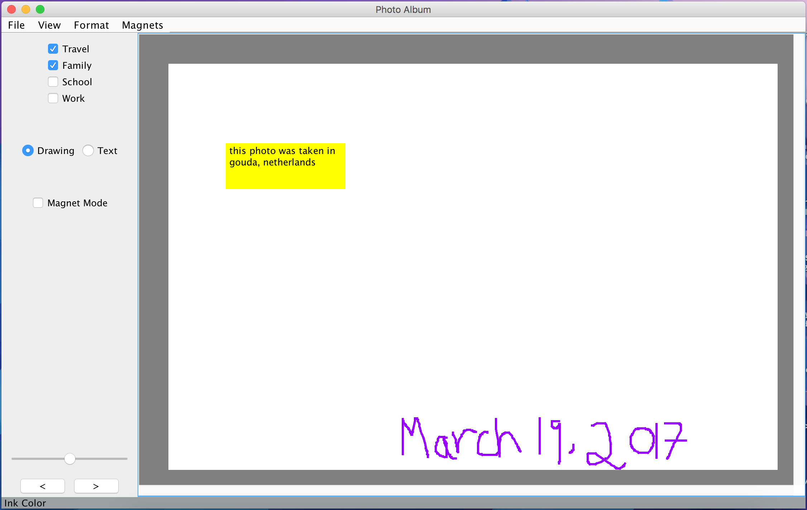

# PhotoAlbum
This is a project I built for the class CS 4470: User Interface Software at Georgia Tech.

Photo Album is an application built with Java, which allows you to view photos, annotate them, and organize them in a variety of ways.

# Features
## Gestures
<p align="center">
    
    
</p>

## Tagging
- Photos can be "tagged" by selecting one or more of Travel, Family, School, or Work on the top left corner of the application.
<p align="center">
    
</p>


## Annotations
- Photos can be annotated in two different ways:
    1. Drawing mode
    2. Text mode (aka a post it)

- To annotate a photo you first have to "flip" it by double clicking on it, then you can select "Drawing" or "Text" from the menu on the left
- In drawing mode, you simply drag your mouse to draw anything you want
- In text mode, you drag your mouse to create a post it, and then type anything you want
<p align="center">
    
</p>

# How to Run
Once you have downloaded the album.jar file, run the following command:

```sh
java -jar album.jar
```
